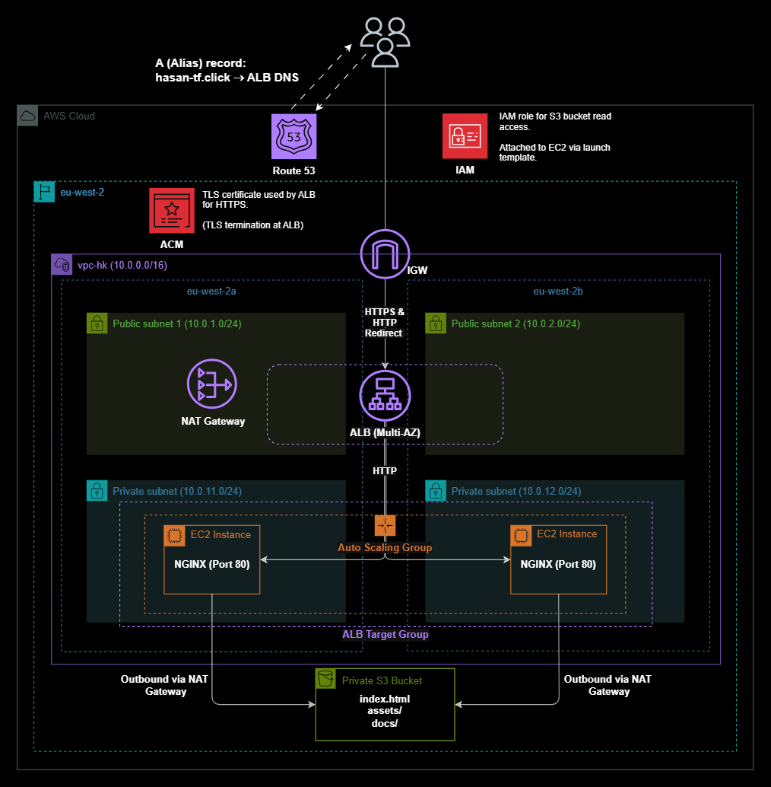
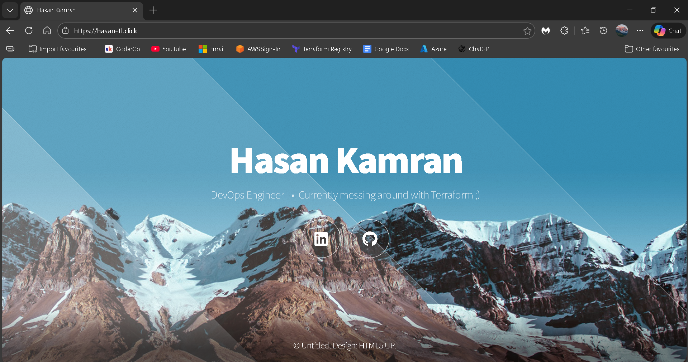

# Highly Available AWS Web Application with Terraform

  

---

## Overview

This project demonstrates a production-style AWS web architecture built entirely with **Terraform**.  
It deploys a **highly available**, **secure**, and **scalable** web application using private EC2 instances behind an Application Load Balancer, with HTTPS enforced (along with HTTP redirect) and infrastructure managed as code.

The goal was not just to make something “work”, but to design it the way you would in a real environment.

---

## Architecture Summary

**High-level flow**

User  
→ Route 53 (custom domain)  
→ Application Load Balancer (HTTPS)  
→ Auto Scaling Group  
→ EC2 instances (Nginx servers)  
→ Static content pulled from private S3  

---

## Live Application

  

*Application served over HTTPS using a custom domain. Also features HTTP redirect*

---

## Key Design Decisions

This architecture mirrors patterns used in real production systems.

- **High availability by default**  
  The ALB and Auto Scaling Group span multiple Availability Zones, avoiding single points of failure.

- **Private-by-design compute**  
  EC2 instances have no public IPs and only accept traffic from the load balancer.

- **HTTPS enforced at the edge**  
  TLS is terminated at the ALB using ACM, with all HTTP traffic redirected to HTTPS.

- **Secure content delivery**  
  Static site files are stored in a private S3 bucket and accessed using least-privilege IAM roles.

- **Operationally simple scaling**  
  Auto Scaling replaces unhealthy instances automatically without manual intervention.

- **Fully reproducible infrastructure**  
  Everything is defined in Terraform, making the environment easy to recreate, review, and extend.

---

## Infrastructure as Code

All AWS resources are provisioned using **Terraform** with a clear modular structure:

- VPC and networking
- Application Load Balancer
- Compute and Auto Scaling

This makes the setup:
- Reproducible
- Version controlled
- Easy to extend or modify safely

---

## Future Improvements & Considerations

Some realistic next steps for this architecture:

- Add an S3 VPC Gateway Endpoint to remove NAT dependency
- Introduce CloudFront for global caching and performance
- Add monitoring and alerts with CloudWatch
- Implement blue/green deployments using weighted routing

---

## Final Notes

This project focuses on **design decisions**, **security**, and **reliability**, not just spinning up resources.  

It reflects how cloud infrastructure is typically built and managed in real environments using Infrastructure as Code.
